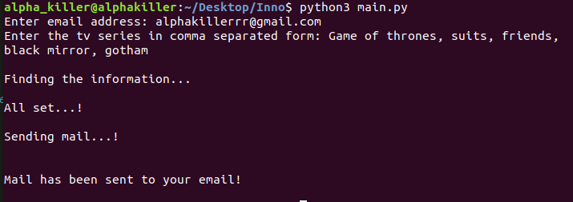
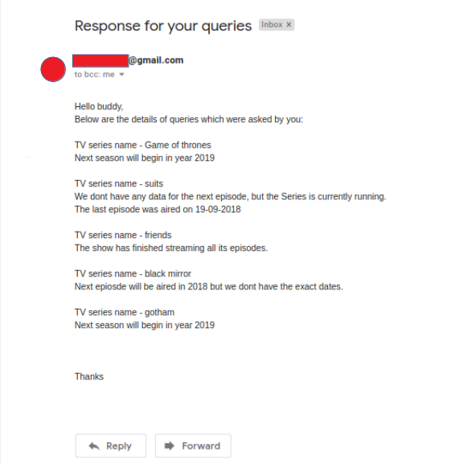

# Summer Intern Hiring Challenge

##
# What does this Application do?
This Program takes input as Email ID of the User and names of TV series. 
The main aim of this program is to send user an email consisting of information regarding when the next episode of these TV series will be aired or the series is finished. 

##

# How to use this Program?

### 1. Please verify these points before executing the code.
  * Make sure your system is installed with Mysql and mysqldb python.
  * SMTPLIB should be installed in your system.
  * Your Gmail should allow third party apps(Less secure apps) to send mails. 
  Check this here - [Click here to check](https://www.google.com/settings/security/lesssecureapps). If it is off, then unblock it.
  * You must be connected to the Internate.
  
### 2. Download the main.py file  

### 3. Changes need to be made before running this program
  * <b>In Line no. 133</b> - Enter the hostname, user and password of mysql database.  
  * <b>In Line no. 167 and 168</b> - Enter Sender's Email address and Password in specified format.  
  
### 4. Run python3 main.py in the terminal(After going to specific directory)
  * You have to give the required input in the terminal, such as your email address and TV series you watch.
  * Then you will receive a mail containing all the information about that TV series(Example Shown below).
  
### See the Example: 
### Terminal :  
  
   
### Received Mail :  
  
  
### DATABASE Info:
DATABASE Name - SERIES_DATABASE_1 
Table Name - userdata  
Tables columns - {email, tvseries} 

### What more can be done in the Future : 
  * 
